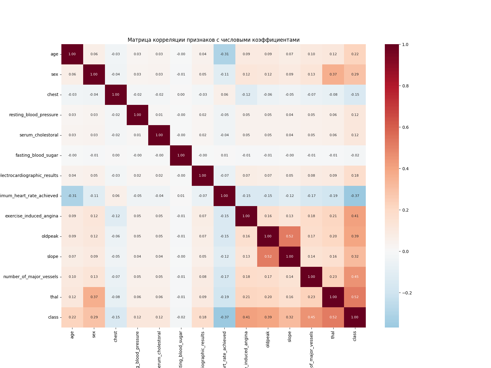
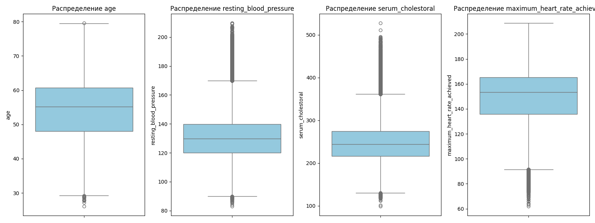
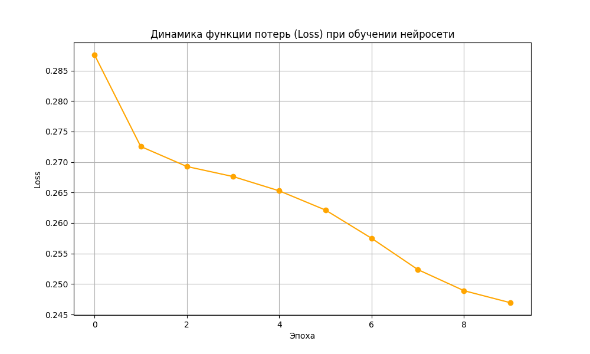

# Прогноз сердечно-сосудистых заболеваний (ССЗ) на основе машинного обучения

Итоговый проект по теме "Глубокое обучение и нейронные сети". Задача — классификация риска наличия ССЗ на основе клинических показателей 1 000 000 пациентов.

## 1. Исследовательский анализ данных (EDA)

В ходе подготовки данных была проведена фильтрация, обработка пропусков и кодирование категориальных признаков.

### Корреляционный анализ
Наибольшую связь с целевой переменной показали признаки: `thal` (тип дефекта), `number_of_major_vessels` и наличие стенокардии.


### Анализ выбросов
Изучены распределения возраста, давления и уровня холестерина. Выявленные биологические выбросы были нивелированы с помощью масштабирования `StandardScaler`.


---

## 2. Обучение и сравнение моделей

В проекте реализованы и сравнены три архитектуры моделей. Нейронная сеть на базе PyTorch показала наилучшую обобщающую способность.


| Модель | Accuracy (Точность) |
| :--- | :--- |
| Logistic Regression | 0.8700 |
| Random Forest | 0.8900 |
| **Deep Neural Network (PyTorch)** | **0.8970** |

### График обучения нейросети
Модель DNN обучалась 10 эпох. Плавное снижение функции потерь подтверждает отсутствие переобучения.


---

## 3. Структура репозитория и файлы
* [ARTICLE.md](ARTICLE.md) — **краткое содержание научной статьи**.
* `CVD_Analysis.ipynb` — Jupyter-ноутбук с полным циклом разработки.
* `predict.py` — скрипт для запуска инференса (предсказания на новых данных).
* `nn_model_weights.pth` — **лучшие веса** нейронной сети.
* `rf_model.pkl` — сохраненная модель Random Forest.
* `requirements.txt` — список необходимых зависимостей.

---

## 4. Инструкция по настройке окружения

1. Установите необходимые библиотеки:
   ```bash
   pip install pandas numpy matplotlib seaborn scikit-learn torch joblib
2. Для запуска обучения откройте ноутбук в Google Colab.
3. Для запуска предсказания используйте скрипт:
   ```bash
   python predict.py

